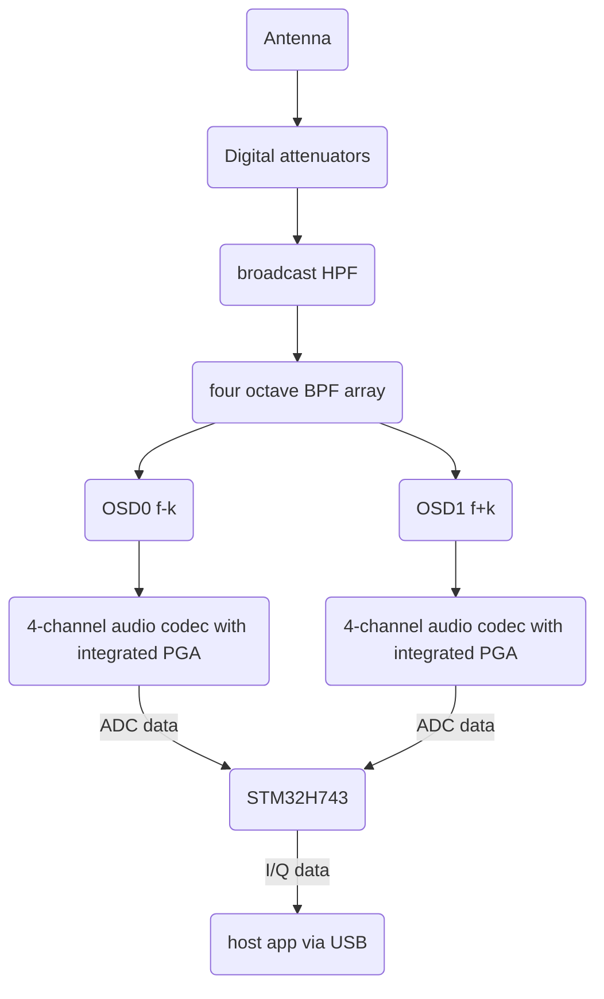
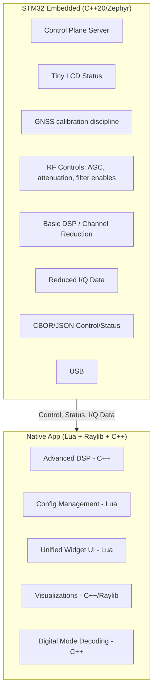

# NexRx: Technical Architecture
## Hardware, Software, and RF Design

### Hardware Architecture

The NexRx hardware platform centers around an STM32H743
microcontroller - a 480MHz Cortex-M7 processor with 1MB of both flash
memory and RAM. This isn't overkill; real-time RF control, web
serving, and DSP processing demand serious computational resources.

### USB to Host Communication Architecture

To achieve bit-perfect data integrity and cross-platform plug-and-play
capability without requiring custom kernel drivers, the architecture
uses a **Vendor-Specific Bulk USB Class utilizing Microsoft OS 2.0
Descriptors**.

By moving away from USB Audio Class 2.0 (UAC2) and embracing Bulk
transfers, the system benefits from hardware-level CRC error-checking
and automatic retransmissions. This guarantees delivery and entirely
eliminates the dropped packets associated with isochronous streams,
keeping the phase determinism perfectly stable for your DSP pipeline.

### Data Stream and Payload

Because the STM32 handles polyphase recombination, dual-OSD frequency
shifting, and cross-correlation internally, the USB payload is
significantly reduced.

* **Channel Count**: The STM32 sends a single, normalized,
  pre-stitched I/Q baseband stream (2 channels) to the host PC.

* **Framing**: The stream consists of 24-bit samples packed into
  32-bit words to ensure optimal DMA alignment.

* **Sample Rate & Bandwidth**: Streaming at 384ksps, this 2-channel,
  32-bit payload consumes a highly stable 24.576 Mbps of Bulk USB
  bandwidth.

### Command and Status Data Path

Control and telemetry data are completely decoupled from the I/Q data
stream, utilizing dedicated endpoints.

* **Command Channel (Endpoint 0x02 OUT)**: The host PC uses this bulk
  endpoint to issue high-level commands, such as target VFO
  frequencies and PGA analog gains, entirely abstracting the hardware
  state from the PC.

* **Telemetry Channel (Endpoint 0x83 IN)**: This bulk/interrupt
  endpoint delivers state feedback, telemetry, and autonomous SNA
  sweep responses back to the host.

* **Command Protection**: Command packets are protected by a purely
  software-based Fletcher-16 checksum loop on the host and STM32 to
  ensure commands are not corrupted.

### Operating System Deployment Matrix

This Vendor-Specific Bulk architecture cleanly satisfies your security
and privilege constraints across all target platforms:

* **Windows (10 / 11)**: 100% Zero-Admin. Windows Plug-and-Play
  manager reads the MS OS 2.0 descriptors and silently binds the
  native `WinUSB.sys` driver in the background with zero UAC or
  installer prompts.

* **macOS**: 100% Zero-Admin. The host application uses native
  user-space APIs (via `libusb` and `IOUSBHost`) to connect directly
  without requiring any kernel extensions.

* **Linux**: Standard Non-Root User Execution. Users will run a
  standard, one-time `sudo` command to copy a udev rule (e.g.,
  `99-nexrx.rules`) into `/etc/udev/rules.d/` to grant read/write
  access to the raw USB nodes.

* **Android**: Zero-Root / User-Space. The mobile app utilizes the
  standard Android USB Host API (`android.hardware.usb`). The OS
  simply displays a one-time permission pop-up asking the user to
  allow the app to access the NexRx SDR.

### Software Architecture

The software stack divides responsibilities between the embedded
system and the native host application, with each handling what it
does best.

### Receiver Architecture

The receive path implements a sophisticated dual-receiver architecture
using independent octature sampling detectors (OSDs). Each OSD
operates as a direct-conversion mixer, producing I and Q baseband
signals that capture both amplitude and phase information of the RF
signal. The two receivers operate simultaneously, each with
independent frequency tuning controlled by separate CPLD-generated
local oscillator signals.

**Signal Path Components:**

**Signal Path Components & Front-End Protection:**

1. **Input Protection & DC Blocking**:
   - A series 1μF/100V C0G capacitor blocks external DC bias from damaging downstream components.
   - Fast primary TVS protection diodes clip RF surges to 25V pk-pk (surviving up to +40 dBm inputs) to protect attenuator switches.
   - Secondary TVS protection diodes clip signals to 13V pk-pk following the attenuators to protect BPF switches and OSD direct-conversion mixers.

2. **Digital Attenuator Array**:
   - Cascaded T-pad network (24 dB, 12 dB, 6 dB, 3 dB) providing 0 to 45 dB attenuation in 3 dB steps.
   - Each stage utilizes an **AS183-92LF pHEMT SPDT switch chip** wired for true bypass when deactivated.

3. **Bandpass Filter (BPF) Selection**:
   - A bank of 4 octave bandpass filters (1.8-3.4 MHz, 3.2-7.5 MHz, 7.3-14.5 MHz, 21.8-30.0 MHz) paired with a broadcast AM high-pass filter (HPF).
   - BPF selection is routed using **SP4T SKY13322-375LF switches** to select among the four BPF branches. This simplifies component count, eliminates an external inverter package, and reduces the STM32 GPIO control pin count by one.

4. **TLV320ADC5140 Integrated PGAs & Anti-Aliasing Filters**:
   - Each TLV320ADC5140 quad-channel audio ADC incorporates programmable gain amplifiers (PGA) providing 0 dB to 42 dB of analog gain control per channel, configured directly via SPI (SPI4).
   - Differential input low-pass anti-aliasing filtering prior to ADC conversion protects baseband Nyquist boundaries.

5. **Waterfall Viewport Mode Hysteresis**:
   - Below 15 MHz, the dual iCE40 CPLDs run in 8-phase Octature mode (OSD). Above 15 MHz, they run in 4-phase Quadrature mode (QSD).
   - To prevent visual display discontinuities when tuning across 15 MHz, mode switching is tied strictly to the active waterfall viewport bounds: switching to 4-phase occurs only when the active display viewport is *strictly above* 15 MHz, and switching to 8-phase occurs only when the active viewport is *strictly below* 15 MHz. When the viewport straddles 15 MHz, the active mode is retained.
   - In 4-phase QSD mode, a +3 dB digital gain scaling is automatically applied in STM32 DSP to normalize the baseline noise floor level with 8-phase mode.

**System Performance & Dynamic Range:**
- **Sensitivity / MDS**: Thermal noise floor at 50Ω, 500 Hz bandwidth is $-141\text{ dBm}$. With a estimated system noise figure of $6\text{ dB}$, Minimum Detectable Signal (MDS) for 10 dB SNR is $\text{MDS} = -125\text{ dBm}$.
- **Instantaneous Dynamic Range**: $\sim 100\text{ dB}$ (ADC limited).
- **Blocking Dynamic Range (BDR)**: $142\text{ dB}$ (+17 dBm max input to -125 dBm MDS).
- **Two-Tone IMD Dynamic Range**: $97\text{ dB}$ (OSD IP3 $+20\text{ dBm}$).

**AGC Implementation:**

AGC operates as a hybrid hardware/software system optimized for both fast protection and smooth user experience:

1. **STM32 Fast Loop**: Measures I/Q signal strength every sample period, switches attenuator pads within microseconds to prevent overload.
2. **Host PC Smoothing**: Applies gain compensation in DSP so the operator perceives smooth signal level changes rather than abrupt attenuator switching.
3. **Attack/Decay**: Fast attack on strong signals (prevent overload), slow decay to avoid pumping on fading signals.
4. **Setbox Control**: AGC characteristics (attack time, decay time, hang time, target level) configurable via setbox inheritance.

Each OSD output feeds into a four-channel audio codec that digitizes the audio-rate signals at 96 kS/s with 24-bit resolution. This baseband data flows to the STM32 for basic conditioning before transmission to the host PC as a single pre-stitched 384 ksps I/Q pair for host PC DSP processing.

### OSD Mapping and QSD Mapping
There are two instances of the "OSD" schematic page, each of which has
its own audio codec, set of eight accumulator capacitors, set of four
four-way switch chips, and cross-wiring to map the differential
RF+/RF- signals to their switch chips as shown below. Each audio codec
has its own TDM output serial line attached to the STM32, where these
audio samples are reduced via DSP.

| Input Signal | Switch Instance | Clock Phase | Accumulator Capacitor | Codec Channel |
| --- | --- | --- | --- | --- |
| RF+ | 0 | 0 | 0 | IN1+ |
| RF+ | 0 | 1 | 1 | IN3+ |
| RF+ | 0 | 2 | 2 | IN2+ |
| RF+ | 0 | 3 | 3 | IN4+ |
| RF+ | 1 | 4 | 4 | IN1- |
| RF+ | 1 | 5 | 5 | IN3- |
| RF+ | 1 | 6 | 6 | IN2- |
| RF+ | 1 | 7 | 7 | IN4- |
| RF- | 2 | 0 | 4 | IN1- |
| RF- | 2 | 1 | 5 | IN3- |
| RF- | 2 | 2 | 6 | IN2- |
| RF- | 2 | 3 | 7 | IN4- |
| RF- | 3 | 4 | 0 | IN1+ |
| RF- | 3 | 5 | 1 | IN3+ |
| RF- | 3 | 6 | 2 | IN2+ |
| RF- | 3 | 7 | 3 | IN4+ |

### Two CPLD Subsystem

The two CPLDs are identical. There is one for each of the two OSD
pipelines. Each CPLD serves as the high-speed clock generation hub,
and houses a frequency counter for the TCXO clock it receives gated by
the 1pps signal from the GNSS receiver.

**Master Clocking:**

A 40 MHz temperature-compensated crystal oscillator (TCXO) provides
the master timebase.

From this 40 MHz reference, the CPLD synthesizes all system clocks.
This is done in one of two modes, settable by software:

* For VFO frequencies below 15MHz, we generate 8 phase octature clocks
  running at VFO * 8 (up to 120MHz).

* For higher VFO frequencies, we generate 8 outputs but these are set
  up as 4 phase quadrature clocking running at VFO * 4 (up to 120MHz).

### STM32 Subsystem

The STM32H743 microcontroller orchestrates all real-time control and
serves as the bridge between RF hardware and host PC.

**Peripheral Usage:**

**I2C Buses:**
- **Audio Codec Configuration**: Sets up the audio codecs (eight baseband channels across dual OSDs)

**SPI Interfaces:**

- **CPLD Configuration**: Bitstream loading and reconfiguration,
  read/write of control and status registers.

- **High-speed peripherals**: Future expansion

**USB/Ethernet:**
- **Primary Interface**: USB 2.0 High-Speed Ethernet gadget (480 Mbps)
  and/or 100Mb CAT5 Ethernet.

**Real-time Control Tasks:**

The STM32 runs Zephyr RTOS managing multiple concurrent tasks:
- RF switching coordination (low pass filter gating, attenuators)
- AGC fast loop (signal strength → attenuator control)
- OSD channel combining into I/Q data
- Command processing from host PC

### Power Sequencing

The NexRx receiver is powered from the USB VBUS supply (5V at 3A
expected). This provides up to 15W of power, which is significantly
more than required for the dual-OSD architecture, dual iCE40 CPLDs,
and supporting digital logic.

## Power Rail Summary

| Rail | Voltage | Capacity | Control | Purpose |
| :--- | :--- | :--- | :--- | :--- |
| **VBUS** | 5.0V | 3.0A | Always On | Primary input power from USB-C. |
| **+3.3V** | 3.3V | 3.0A | Automatic | Main digital logic supply (MCU, CPLDs, Si5351). |
| **+5VA** | 5.0V | 300mA | Automatic | Analog supply for audio ADCs / Codecs. |
| **+3.3VA** | 3.3V | 300mA | Automatic | Clean analog supply for RF front-end, PGAs, and buffers. |

## Design Verification & Power Sequencing Notes

1.  **Automatic Power Sequencing:** Subsystem power rails feature
    hardware RC delay networks and automatic LDO/regulator sequencing.
    MCU software control is not required to sequence power rails
    during startup or shutdown.
2.  **Input Protection:** The VBUS input includes ESD protection and a
    TVS diode to clamp input surges.
3.  **Conversion Efficiency:** The main 3.3V digital rail uses a
    high-efficiency synchronous buck converter to minimize thermal
    dissipation inside the enclosure.
4.  **Analog Integrity:** Sensitive analog rails (+5VA, +3.3VA)
    utilize ultra-high PSRR LDO regulators to preserve low noise floor
    and high dynamic range.

The STM32 manages power-up and power-down sequencing for all
subsystems. Proper sequencing prevents damage and ensures reliable
startup.

**Note**: Detailed power sequencing design is still in development.
The following outlines requirements and approach:

**STM32 Power:**
- Single 3.3V rail, no sequencing required for STM32 itself
- VBAT pin connects to 3.3V (no battery backup planned)
- STM32 boots on internal 64 MHz HSI clock

**Startup Sequence:**
1. STM32 3.3V powers on using the "3.3V ON" power rail, which is
   enabled immediately upon availability of VBUS power from USB.
1. STM32 boots on internal clock.
1. STM32 switches to external crystal clock.
1. STM32 configures the two CPLDs (simultaneously by selecting them
   both on its SPI bus) with an image from its flash file system.
1. STM32 configures the receiver for the current VFO frequency F,
   setting the OSDs' clock generators to F +/- 12kHz.
1. STM32 configures the audio codec to set up the I/Q channel I/O.
1. STM32 connects with the host PC application (if present) over USB.
1. Ready to receive.

### Development Standards and Practices

The project maintains consistent coding standards across both embedded
and host application components. All code uses CamelCase naming
conventions for variables, functions, and methods, with SNAKE_CASE
reserved only for constants and preprocessor macros.

The embedded system targets C++20 running on Zephyr RTOS, taking
advantage of modern language features for safer and more expressive
code. The host application leverages a high-performance C++ DSP core
integrated with a Lua 5.4 scripting environment for UI and high-level
logic, utilizing Raylib for hardware-accelerated rendering.

**Performance Requirements**: The system maintains sub-100ms response
times for critical RF parameter changes, continuous I/Q streaming at
384ksps, and smooth real-time waterfall displays via the host PC app.
These requirements drive many of the architectural decisions,
particularly the division of responsibilities between embedded and
native host components.

**Communication Protocol**: The system uses binary frames for
high-throughput I/Q data and structured messages (CBOR or JSON) for
control and status updates. This hybrid approach optimizes for both
efficiency and developer productivity.

### Hardware Interface Abstractions

The embedded software provides clean C++20 abstractions for all
hardware interfaces. pHEMT FET switching, Si5351 synthesizer
configuration, and other RF parameter adjustment all use
object-oriented interfaces that hide hardware complexity from
higher-level code.

These abstractions enable rapid development and testing while
maintaining the real-time performance requirements of RF operation.
The modular design also simplifies hardware variations and upgrades
without requiring extensive software changes.

### Testing and Validation Strategy

Real-time RF systems present unique testing challenges that require
both automated testing and careful measurement validation. The project
includes provisions for automated testing of DSP algorithms,
communication protocols, and user interface components.

Hardware validation requires RF test equipment for measuring receive
sensitivity and various distortion and harmonic responses.

The open-source nature of the project enables distributed testing
across different operating environments and use cases, helping
identify issues that might not appear in controlled laboratory
conditions.
