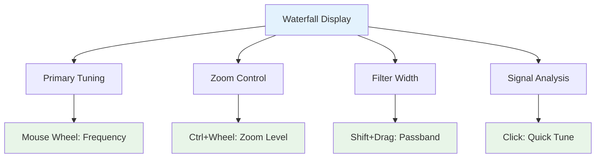
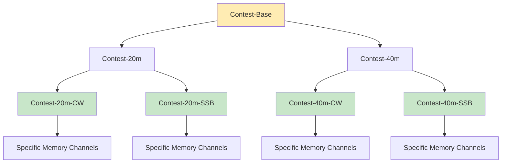

# NexRx: User Experience & Features
## Interface Design, Workflows, and Operating Features

### The Browser-Native Interface

Opening NexRx feels nothing like traditional radio software. There's
no installation process, no driver hunting, no compatibility concerns
across operating systems. Plug in the USB cable, open Chrome or
Safari, navigate to the captive portal, and you're immediately
presented with a modern, responsive interface that feels more like a
professional audio application than a ham radio.

The interface adapts to your screen size and usage patterns. On a
large monitor, you might have multiple waterfall displays showing
different zoom levels, constellation plots for digital modes, and
audio analysis tools. On a tablet, the interface reorganizes to
prioritize the most commonly used controls while keeping advanced
features accessible through intuitive gestures.

### Waterfall-Centric Operation

The waterfall display serves as far more than just a spectrum
visualization - it becomes a primary control surface. Mouse wheel
scrolling tunes frequency with pixel-level precision, while modifier
keys enable different functions directly on the graphical display.



Multiple waterfall displays can show different perspectives
simultaneously. A wide-band view might cover the entire 40-meter band
while a detailed view focuses on the immediate area around your tuning
frequency. Each display can use different color schemes optimized for
different types of signal analysis.

### Setbox Workflow in Practice

Let's walk through a realistic operating scenario to show how setboxes
transform the user experience. Imagine you're preparing for the ARRL
DX Contest and want to set up configurations for different bands and
modes.

**Setting Up Base Configurations**: Start by creating a "Contest-Base"
setbox that defines common contest settings - perhaps reduced power
for battery operation, specific antenna selections, and your contest
station callsign configuration. This becomes a parent setbox that
other configurations inherit from.

**Band-Specific Adjustments**: Create "Contest-20m" and "Contest-40m"
setboxes that inherit from "Contest-Base" but add band-specific
antenna selections, power levels optimized for each band's propagation
characteristics, and frequency memories for each band's contest
segments.

**Mode-Specific Refinements**: Add "Contest-20m-CW" and
"Contest-20m-SSB" setboxes that inherit from "Contest-20m" but
configure mode-specific parameters like CW tone frequency, transmit
audio equalization, or AGC settings optimized for weak signal work
versus pile-up busting.



**Live Operation**: During the contest, switching between
"Contest-20m-CW" and "Contest-40m-SSB" instantly reconfigures
everything - antenna selection, power level, audio processing,
waterfall color scheme, even the keyboard shortcuts active for that
mode. No knob turning, no menu diving, no forgetting to switch
antennas.

### Inheritance Inspector and State Management

One of NexRx's most powerful features is making the setbox
inheritance system completely transparent. When you adjust any
control, the interface shows exactly where that setting's value comes
from in the inheritance hierarchy.

Suppose you're adjusting transmit power and notice it's set to 50
watts. The inheritance inspector might show: "Power Level: 50W
(inherited from Contest-Base → overridden in Contest-20m → using
default from Contest-20m-CW)". This transparency makes it easy to
understand why settings have particular values and where to make
changes for different effects.

The interface clearly distinguishes between the live operating state
and saved setbox configurations. When you modify a parameter from its
saved value, the control changes color and displays a modification
indicator. You can then choose to:

- **Save**: Update the current setbox with your live changes
- **Save As**: Create a new child setbox inheriting from the current
  one
- **Revert**: Discard changes and reload the saved state

This workflow encourages experimentation while preventing accidental
overwrites of carefully configured setboxes.

### Advanced Visualization and Analysis

Because significant DSP processing happens in the browser, NexRx can
provide visualization and analysis tools that would be impossible in
traditional hardware radios.

**Constellation Diagrams**: For digital modes like PSK31 or FT8,
real-time constellation plots provide immediate feedback on signal
quality and decoding performance. The plots update in real-time,
showing the effects of propagation changes, interference, or equipment
adjustments.

**Audio Analysis Tools**: Switchable oscilloscope and spectrum
analyzer views of demodulated audio help with precise adjustment of
receive and transmit audio equalization. These tools are invaluable
for optimizing digital mode performance or adjusting SSB audio
characteristics.

**Multi-Domain Signal Analysis**: The interface can simultaneously
display time-domain, frequency-domain, and statistical analysis of
received signals, providing insights that help with everything from
antenna tuning to interference identification.

### Memory and Logging Systems

Traditional memory channels become much more powerful in the setbox
paradigm. Instead of just storing frequency and mode, a NexRx memory
can capture the complete operating state - antenna selections, DSP
settings, power levels, even waterfall color schemes.

**Tagged Memory System**: Memories include arbitrary tags, colors,
creation timestamps, and usage tracking. You might tag memories with
"DX", "Contest", "Ragchew", or "EmComm" and then filter displays to
show only relevant memories for your current activity.

**Complete State Recording**: The system maintains a chronological log
of all state changes with replay capability. This feature proves
invaluable for debugging equipment problems, analyzing your operating
patterns, or simply understanding how propagation changes affected
your station configuration choices.

**Voice Memory Integration**: Voice memories integrate naturally with
the setbox system. Record voice snippets tagged with specific modes,
bands, or activities. The system can automatically select appropriate
audio processing and equalization based on the current setbox
configuration.

### Multi-Modal Control Integration

NexRx leverages the full range of modern input methods rather than
forcing everything through point-and-click interfaces.

**Keyboard-Centric Operation**: Comprehensive keyboard shortcuts
provide rapid access to all major functions. Power users can operate
almost entirely from the keyboard, with shortcuts that adapt based on
the current mode and band selection.

**Gesture-Based Controls**: On touch devices, intuitive gestures
handle common operations. Pinch-to-zoom on waterfall displays, swipe
gestures for quick band changes, or long-press actions for accessing
secondary functions.

**Context-Sensitive Interfaces**: The interface adapts to your current
activity. When tuning CW signals, the controls emphasize tone
frequency and keying characteristics. During SSB operation, audio
processing and microphone controls become prominent.

### Advanced Features and Capabilities

**Multiple Simultaneous Receive Points**: The browser can process
multiple independent receive frequencies from the same I/Q data
stream, each with independent filtering, demodulation, and display.
Monitor the calling frequency while working a net, or keep an ear on
emergency frequencies during normal operation.

**Adaptive Filtering and Processing**: Create notch filters of
arbitrary width and depth directly on the waterfall display. Drag to
position, scroll to adjust depth, modifier keys to change bandwidth.
The system remembers these filters in the appropriate setboxes for
automatic application in similar situations.

**Automatic Signal Processing**: CW reception can automatically tune
to your preferred tone frequency. SSB audio processing adapts to voice
characteristics or band conditions. Digital mode decoding happens
continuously in the background with results displayed in real-time.

**Antenna and Tuner Integration**: The system manages antenna
switching and tuner settings as part of the setbox inheritance system.
Define antenna preferences globally, override them for specific bands
or modes, and let the system handle the switching automatically.

### Development and Customization

The browser-based architecture makes customization and enhancement
much more accessible than traditional radio firmware modification. Web
developers can contribute interface improvements using familiar tools
and frameworks.

The setbox data format uses standard JSON, making it easy to create
external tools for setbox management, backup, or sharing
configurations between operators. Advanced users can manipulate their
configurations programmatically or integrate NexRx with other station
automation systems.

The open-source nature means the entire ham community can contribute
improvements, from bug fixes and feature additions to completely new
interface paradigms that leverage the flexible setbox foundation.

This combination of powerful core concepts, modern interface design,
and community-driven development creates a platform that can evolve
with the changing needs of ham radio while maintaining the real-time
performance and reliability that RF communication demands.

## Modular UI Architecture and State Management

To support this highly dynamic and flexible user experience, the UI is built on a modular, reactive architecture that strictly separates hardware state from its presentation.

### Separation of Concerns
The current settings and modification methods associated with any hardware feature are decoupled from the specific UI widgets that control them. Because multiple UI widgets may collaborate or overlap in controlling the same hardware features, this separation prevents tightly coupled code. The hardware state acts as the single source of truth.

### Independent Widget Modules
UI widgets are independent modules, each defined in its own Lua file. The main UI creation process imports and instantiates these modules. Widgets form a hierarchy—ranging from complex collection containers down to "leaf" widgets like pushbuttons and checkboxes. Each widget's configuration (whether it relies on its own internal state variables or those of its sub-widgets) is ultimately tied back to the central state management. 

### Dynamic Instantiation via Setbox Rules
Widgets are instantiated, themed, and parameterized entirely by setbox rules. These rules can alter a widget's instance data, theme, or parameters at any time. When tags change or when rules are added, modified, or removed, the system evaluates the new final values, and the UI reacts instantly to reflect the updated configuration.

### Hardware-Driven Initialization
The state of the hardware is initialized **from** the hardware (or the digital twin), not dictated by the app on startup. If the app restarts, or if it loses and regains its connection, it will read and reflect the hardware's actual operating state. The UI's responsibility is solely to display this state to the user and to allow the user to mutate it using the flexible setbox rules.

### Reactive State Graph
To keep the UI in sync with the hardware and with other widgets without creating infinite loops, the system relies on a reactive property graph. Widgets build observers of the hardware state into their logic. When the hardware changes (either natively or triggered by another UI element), the observers notify the widget to update its presentation.

---

# Reactive Property System Design

A minimal reactive core for Lua to enable automatic dependency tracking and change propagation for UI layout and configuration.

## Core Concepts

```
┌─────────────────────────────────────────────────────────────┐
│  Reactive Graph                                             │
│                                                             │
│  [Observable]──────►[Computed]──────►[Computed]             │
│       │                  │               │                  │
│       ▼                  ▼               ▼                  │
│  [Computed]         [Watcher]       [Watcher]               │
│       │              (UI update)    (DSP update)            │
│       ▼                                                     │
│  [Watcher]                                                  │
│                                                             │
│  On change: topological propagation, no glitches            │
└─────────────────────────────────────────────────────────────┘
```

## Minimal Implementation (~150 lines core)

```lua
-- reactive.lua - Minimal reactive property system

local Reactive = {}
Reactive.__index = Reactive

-- Global state for dependency tracking
local currentComputed = nil  -- The computed currently being evaluated
local batchDepth = 0         -- For batching multiple changes
local pendingUpdates = {}    -- Computeds needing re-evaluation

-------------------------------------------------------------------------------
-- Observable: a value that tracks its dependents
-------------------------------------------------------------------------------
function Reactive.observable(initialValue)
    local self = {
        _value = initialValue,
        _dependents = {},  -- set of computeds that read this
    }

    return setmetatable(self, {
        __call = function(t, newValue)
            if newValue == nil then
                -- READ: track dependency
                if currentComputed then
                    t._dependents[currentComputed] = true
                    currentComputed._dependencies[t] = true
                end
                return t._value
            else
                -- WRITE: update and notify
                if t._value ~= newValue then
                    t._value = newValue
                    Reactive._notify(t._dependents)
                end
            end
        end
    })
end

-------------------------------------------------------------------------------
-- Computed: a derived value that auto-updates
-------------------------------------------------------------------------------
function Reactive.computed(fn, writeFn)
    local self = {
        _fn = fn,
        _writeFn = writeFn,      -- optional: makes it read-write
        _value = nil,
        _dirty = true,
        _dependencies = {},       -- observables/computeds we read
        _dependents = {},         -- computeds that read us
        _level = 0,               -- for topological ordering
    }

    local function evaluate()
        -- Clear old dependencies
        for dep in pairs(self._dependencies) do
            dep._dependents[self] = nil
        end
        self._dependencies = {}

        -- Track new dependencies during evaluation
        local prevComputed = currentComputed
        currentComputed = self

        local ok, result = pcall(self._fn)

        currentComputed = prevComputed

        if ok then
            self._value = result
            self._dirty = false
            -- Update level (max of dependencies + 1)
            local maxLevel = 0
            for dep in pairs(self._dependencies) do
                if dep._level and dep._level > maxLevel then
                    maxLevel = dep._level
                end
            end
            self._level = maxLevel + 1
        else
            error("Computed evaluation failed: " .. tostring(result))
        end
    end

    return setmetatable(self, {
        __call = function(t, newValue)
            if newValue == nil then
                -- READ
                if t._dirty then
                    evaluate()
                end
                -- Track dependency
                if currentComputed then
                    t._dependents[currentComputed] = true
                    currentComputed._dependencies[t] = true
                end
                return t._value
            else
                -- WRITE (if writeFn provided)
                if t._writeFn then
                    t._writeFn(newValue)
                else
                    error("Cannot write to read-only computed")
                end
            end
        end
    })
end

-------------------------------------------------------------------------------
-- Watcher: run side effects when dependencies change
-------------------------------------------------------------------------------
function Reactive.watch(fn, callback)
    local deps = {}

    local function run()
        -- Clear old deps
        for dep in pairs(deps) do
            dep._dependents[run] = nil
        end
        deps = {}

        -- Track dependencies
        local prevComputed = currentComputed
        currentComputed = { _dependencies = deps }

        local value = fn()

        -- Register as dependent
        for dep in pairs(deps) do
            dep._dependents[run] = true
        end

        currentComputed = prevComputed

        if callback then
            callback(value)
        end
    end

    -- Wrap for notification system
    local watcher = {
        _dirty = false,
        _level = 9999,  -- watchers run last
        _run = run
    }

    run._watcher = watcher
    run()  -- Initial run to collect dependencies

    return function()
        -- Cleanup function
        for dep in pairs(deps) do
            dep._dependents[run] = nil
        end
    end
end

-------------------------------------------------------------------------------
-- Change propagation with topological ordering
-------------------------------------------------------------------------------
function Reactive._notify(dependents)
    for dep in pairs(dependents) do
        if dep._dirty ~= nil then  -- it's a computed
            dep._dirty = true
            pendingUpdates[dep] = true
        end
        if dep._watcher then  -- it's a watcher
            pendingUpdates[dep._watcher] = true
        end
    end

    if batchDepth == 0 then
        Reactive._flush()
    end
end

function Reactive._flush()
    -- Sort by level (topological order)
    local sorted = {}
    for item in pairs(pendingUpdates) do
        table.insert(sorted, item)
    end
    table.sort(sorted, function(a, b)
        return (a._level or 0) < (b._level or 0)
    end)

    pendingUpdates = {}

    -- Re-evaluate in order
    for _, item in ipairs(sorted) do
        if item._run then
            item._run()  -- watcher
        end
        -- computeds re-evaluate lazily on next read
    end
end

-------------------------------------------------------------------------------
-- Batching: group multiple changes into one update cycle
-------------------------------------------------------------------------------
function Reactive.batch(fn)
    batchDepth = batchDepth + 1
    local ok, err = pcall(fn)
    batchDepth = batchDepth - 1

    if batchDepth == 0 then
        Reactive._flush()
    end

    if not ok then error(err) end
end

return Reactive
```

## Usage Example

```lua
local R = require("reactive")

-- Simple observables
local width = R.observable(100)
local height = R.observable(50)

-- Computed property (auto-updates when width/height change)
local area = R.computed(function()
    return width() * height()
end)

-- Bidirectional computed (read-write)
local widthPercent = R.computed(
    function() return width() / 800 * 100 end,    -- read
    function(pct) width(pct / 100 * 800) end      -- write
)

-- Watcher (side effects)
R.watch(function() return area() end, function(val)
    print("Area changed to: " .. val)
end)

-- Usage
print(area())        --> 5000
width(200)           --> "Area changed to: 10000"
print(area())        --> 10000

widthPercent(50)     --> sets width to 400
                     --> "Area changed to: 20000"

-- Batch multiple changes (single notification)
R.batch(function()
    width(300)
    height(100)
end)
--> "Area changed to: 30000" (once, not twice)
```

## Integration with SetBox

```lua
-- Bridge SetBox properties to reactive system
local function reactiveProperty(name, initial)
    local obs = R.observable(initial)

    -- SetBox -> Reactive
    setbox.onPropertyChange(function(n, v)
        if n == name then obs(v) end
    end)

    -- Reactive -> SetBox (if bidirectional needed)
    -- R.watch(function() return obs() end, function(v)
    --     setbox.setProperty(name, v)
    -- end)

    return obs
end

local bandpassWidth = reactiveProperty("bandpassWidth", 500)
local bandpassCenter = reactiveProperty("bandpassCenter", 700)

-- Computed: effective passband edges
local lowEdge = R.computed(function()
    return bandpassCenter() - bandpassWidth() / 2
end)

local highEdge = R.computed(function()
    return bandpassCenter() + bandpassWidth() / 2
end)
```

## What This Gets You

| Feature | Included |
|---------|----------|
| Automatic dependency tracking | Yes |
| Lazy evaluation (compute on read) | Yes |
| Topological update order (no glitches) | Yes |
| Batched updates | Yes |
| Bidirectional computed | Yes |
| Watchers for side effects | Yes |
| Cleanup/disposal | Yes |

## What's Missing (for later)

- **Arrays/collections** - observing list mutations
- **Deep reactivity** - nested tables
- **Async computeds** - for debouncing
- **Debug tooling** - visualize dependency graph
- **Cycle detection** - currently would stack overflow

This is roughly what Vue.js 3's reactivity core does, scaled down. ~150 lines gets you 80% of the value. The remaining 20% (collections, deep reactivity, debugging) would add another 200-300 lines.

## Existing Lua Libraries Evaluated

| Library | License | Dependency Tracking | Lua 5.4 | Active |
|---------|---------|---------------------|---------|--------|
| Push | MIT | Computed properties, knockout.js-style | Unknown | Last commit 2021 |
| FRLua | MIT | Properties with combine/map | Explicitly <5.4 | Dormant |
| RxLua | MIT | Streams, not properties | Unknown | Last release 2017 |
| lua-reactivex | MIT | Streams, not properties | Unknown | Last release 2020 |

None of these are actively maintained or confirmed Lua 5.4 compatible, which motivated this custom design.
